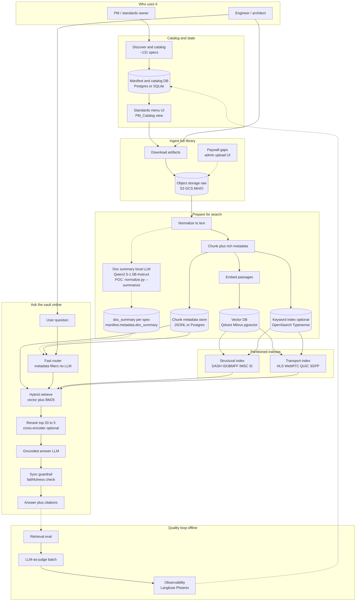
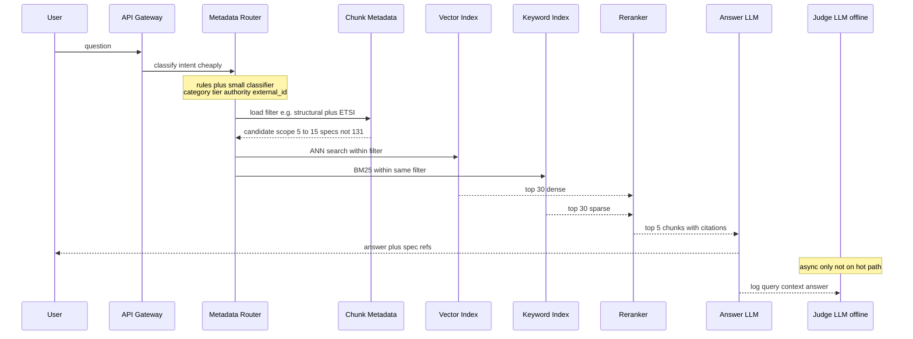

# VSPP Standards Vault — Product flow + tech options (full system)

Target state: **full catalog ingested**, production RAG with **low-latency retrieval** via rich chunk metadata (filter before embed search).

**Preview:** Markdown: Open Preview (`Ctrl+Shift+V` / `Cmd+Shift+V`) or GitHub.

---

## 1. End-to-end product flow (with tech per step)

---

## 2. Online path — cut latency with metadata first

Search **only the right slice** of the corpus before vector math or LLM calls.

**Metadata stored on every chunk (POC fields → production):**

| Field | Use at query time |
|-------|-------------------|
| `authority`, `external_id`, `source` | Hard filter — skip AV1 index for ISOBMFF questions |
| `category`, `tier` | Route structural vs transport index |
| `core_structural_syntax` | Boost or restrict to nine core specs |
| `title`, `char_start` / `char_end` | Citations without re-opening PDF |
| `normalized_path`, `chunk_id` | Dedup and audit trail |
| Optional `section_heading`, `spec_version` | Finer filters if extracted at normalize |
| `doc_summary` per spec **(POC: `normalize.py --summarize`, local LLM Qwen2.5-1.5B-Instruct, idempotent via `input_sha256`)** | Router picks 1–3 docs without embedding full catalog; production embeds the summary as a virtual doc-level chunk |

---

## 3. Tech options by layer

### Catalog and orchestration

| Step | Product job | Tech options |
|------|-------------|--------------|
| Discovery | Crawl sources, build manifest | **POC:** `discover.py` · **Scale:** scheduled jobs (Airflow, Temporal, CronK8s) |
| State | Source of truth for ingest status | **Postgres** (manifest rows) · **SQLite** (small deploy) · export `discovery_manifest.json` |
| PM menu | Human-readable catalog | `PM_Catalog.md` · internal web UI · Notion sync |

### Storage

| Layer | What is stored | Tech options |
|-------|----------------|--------------|
| Raw artifacts | PDF, HTML, zip, repo archives | **S3** · **GCS** · **MinIO** · local `data/` (POC) |
| Normalized text | One `.txt` per spec | Object storage prefix `normalized/` · **Parquet** for analytics |
| Chunk store | Passages + metadata | **JSONL** (POC) · **Postgres** · **DuckDB** |
| Vectors | Embeddings per chunk | **Qdrant** · **Milvus** · **Weaviate** · **pgvector** · flat `vectors.npy` (POC) |
| Keyword | Lexical recall for exact terms | **OpenSearch** · **Elasticsearch** · **Typesense** · **Tantivy** embedded |
| Cache | Hot passages, router decisions | **Redis** · **CDN** for static spec summaries |

### Prepare pipeline (offline)

| Step | POC | Scale options |
|------|-----|----------------|
| Normalize | `normalize.py`, pypdf, BS4 | **Ray** / **Spark** for parallel PDFs · **Unstructured** · **Docling** |
| Doc summary | `normalize.py --summarize`, **`Qwen/Qwen2.5-1.5B-Instruct`** via `transformers` + `accelerate`, single-pass or map-reduce, deterministic decoding, idempotent on `input_sha256` | **vLLM** / **Ollama** server for batch summaries · larger instruct models (Llama 3 8B, Qwen2.5 7B/14B) · summary embedded as a virtual doc-level chunk for router |
| Chunk | `chunk.py`, paragraph_pack_v1 | Adaptive chunking by heading · **LlamaIndex** node parser |
| Embed | `embed.py`, MiniLM | **bge-small** / **e5-base** (quality) · **voyage** / **OpenAI** APIs · **TEI** / **Triton** self-hosted GPU |
| Index build | Single index | **Two collections** (structural / transport) · per-authority shards if corpus grows |

### Online retrieval (low latency)

| Step | Goal | Tech options |
|------|------|--------------|
| Router | Cut search space in ms | Rule engine on keywords (DASH, moof, MPD) · **embedding router** on spec summaries only · lightweight **classifier** (fastText, small BERT) — **avoid LLM here** |
| Filter | Apply metadata before ANN | Vector DB payload filters (Qdrant `must`) · SQL `WHERE authority IN (...)` |
| Dense search | Semantic match | ANN HNSW in Qdrant/Milvus · **FAISS** in-process for small deploy |
| Sparse search | Acronyms, clause numbers | BM25 alongside dense · **RRF** fusion |
| Rerank | Precision on top 20→5 | **Cohere Rerank** · **bge-reranker** · **cross-encoder** on GPU · skip if latency budget tight |
| Answer LLM | Grounded generation | **GPT-4o** · **Claude** · **Gemini** · **Llama** on **vLLM** / **Ollama** · prompt: cite chunk_ids only |
| Sync guard | Block hallucinations on hot path | **LlamaGuard**-style classifier · **smaller LLM** yes/no grounded · regex check chunk_ids cited |
| Caching | Repeat questions | Cache `(filter_key, query_hash) → top chunks` in Redis |

### LLM-as-a-judge (offline only — not on ask path)

| Metric | Question | Tech options |
|--------|----------|--------------|
| Faithfulness | Answer supported by chunks? | **GPT-4o** / **Claude** judge prompt · **RAGAS** · **DeepEval** |
| Answer relevance | Does it address the user? | Same judge · rubric scoring 1–5 |
| Context precision | Were retrieved chunks useful? | Judge compares query vs chunks · feeds `queries.jsonl` baseline |
| Pipeline | Batch, async | **Kafka** / **SQS** queue · **Langfuse** / **Phoenix** / **Braintrust** traces · alert Slack on regression |

---

## 4. POC → production mapping

| Phase | Product outcome | POC today | Production direction |
|-------|-----------------|-----------|----------------------|
| Catalog | Full standards menu | `discover.py`, manifest | Postgres + scheduled discover |
| Ingest | All ingestible specs in vault | `ingest.py` selective | Bulk workers + S3 raw |
| Prepare | Searchable cited chunks | normalize → chunk → embed | Partitioned vector + BM25 indexes |
| Doc summaries | Per-spec context for routing | `normalize.py --summarize` writes `metadata.doc_summary` via local Qwen2.5-1.5B-Instruct | Bulk summary worker, larger instruct model, summary as virtual doc-level chunk feeding the router |
| Quality | Trust and regression tests | `eval_retrieval.py` | RAGAS + judge LLM offline |
| Ask | Engineer Q&A | eval only | API: router → filter → retrieve → LLM |
| Pipeline runner | Reproducible local end-to-end | [`run_pipeline.sh`](run_pipeline.sh) (bash; honors `.venv`) | Same DAG in Airflow / Temporal with per-step retries and queues |

---

## 5. Full-ingest scope

- **In vault:** all public rows in the ~131-spec catalog (PDFs, TR HTML, GitHub repos, IETF text, 3GPP where extractable).
- **Gaps:** paywalled ISO/CTA flagged; admin upload path.
- **Latency principle:** metadata narrows **which specs and which index** before embedding search; judge and eval stay **off the hot path**.
