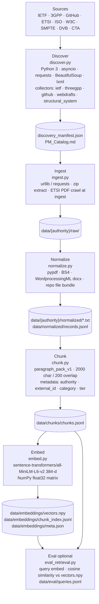

# VSPP-RAG — POC (high level)

Local CLI pipeline: run steps **in order** (discover → ingest → normalize → chunk → embed → eval). No API, chat UI, or hosted vector DB.

**Preview:** Markdown: Open Preview (`Ctrl+Shift+V` / `Cmd+Shift+V`).

*Pipeline order is synchronous (manual CLI). Inside **Discover**, collectors run in parallel via `asyncio`, then one manifest is written.*

## Phases

| # | Step | Script | Output | Technology (POC) |
|---|------|--------|--------|------------------|
| 1 | Sources | — | — | Public standards sites and APIs |
| 2 | Discover | `discover.py` | `discovery_manifest.json`, `PM_Catalog.md` | Python 3 · `asyncio` · `requests` · BeautifulSoup · `lxml` |
| 3 | Ingest | `ingest.py` | `data/{authority}/raw/` | `urllib` / `requests` · zip extract · ETSI PDF crawl at ingest |
| 4 | Normalize | `normalize.py` | `*.txt`, `records.jsonl` | `pypdf` (PDF) · BS4 (HTML) · WordprocessingML (docx) · repo file bundle |
| 5 | Chunk | `chunk.py` | `chunks.jsonl` | Paragraph packing · 2000 char / 200 overlap · metadata on each chunk |
| 6 | Embed | `embed.py` | `vectors.npy`, `chunk_index.jsonl`, `meta.json` | **`sentence-transformers/all-MiniLM-L6-v2`** (384-d) · NumPy float32 matrix |
| 7 | Eval | `eval_retrieval.py` | stdout pass/fail | Query embed + **cosine similarity** vs `vectors.npy` · `queries.jsonl` |

`normalize.py` does **not** update the manifest.

## Dependencies (`requirements.txt`)

`requests` · `beautifulsoup4` · `lxml` · `pypdf` · `numpy` · `sentence-transformers` (pulls **PyTorch** for encoding)

## Scope today

- **Catalog:** ~131 standards listed; ingest is **selective** (not all rows downloaded).
- **Searchable corpus:** ingest → normalize → chunk → embed (~2–3k chunks typical).
- **Retrieval:** embedding similarity only; **no LLM answers**, reranker, or BM25.

## Not in POC

Answer generation, MCP/API, hosted vector DB, hybrid search, scheduled jobs, full-catalog bulk ingest.

**Ops detail:** [`AGENT_HANDOFF.md`](AGENT_HANDOFF.md) · **Production target:** [`DIAGRAM.md`](DIAGRAM.md)
